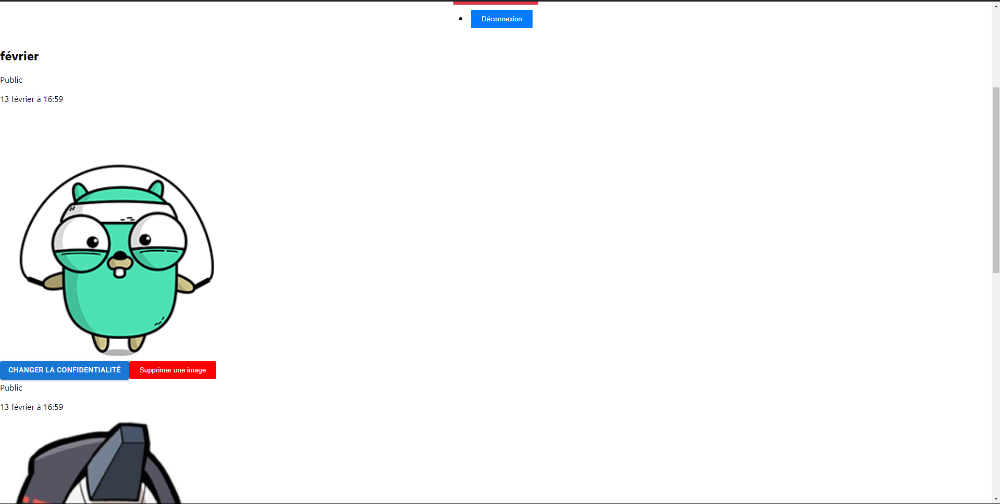
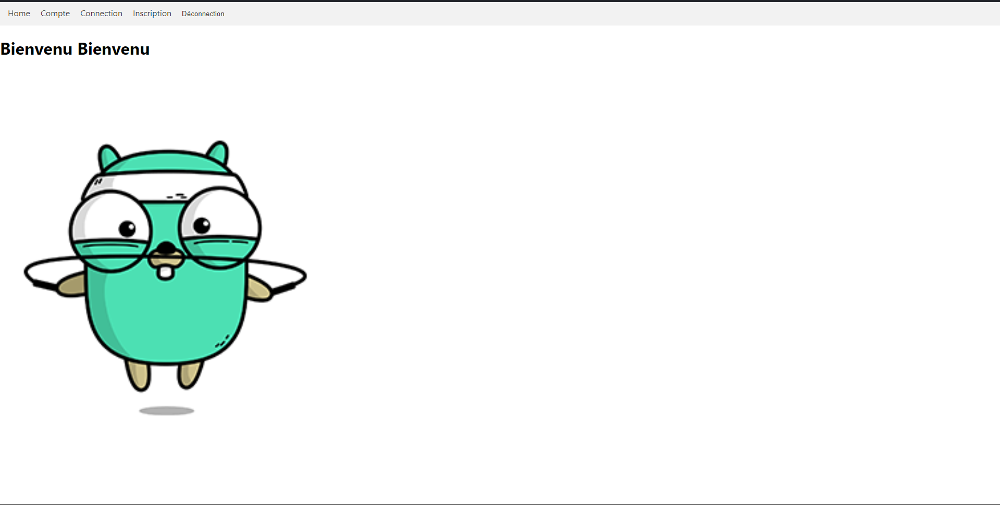
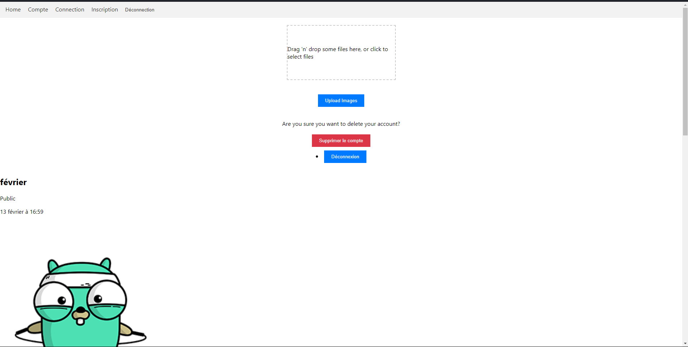

# A3 Dev - NWS ImageShack

Ce projet consiste en un service d'hébergement d'images appelé "A3 Dev - NWS ImageShack". L'objectif de ce service est de permettre aux utilisateurs de partager facilement leurs images drôles et leurs exemples de code. Les utilisateurs peuvent s'inscrire, uploader des images, les gérer et les rendre accessibles au public ou privées.

## Fonctionnalités

- **Inscription**: Les utilisateurs peuvent s'inscrire en fournissant un login et un mot de passe. Aucune vérification par e-mail n'est nécessaire. Les utilisateurs peuvent également supprimer leur compte en un clic, conformément au RGPD.

- **Liste des images de l'utilisateur**: Les images téléchargées par l'utilisateur sont affichées dans l'interface. Elles sont triées par date et regroupées par mois.

- **Modification de l'accessibilité d'une image**: Les utilisateurs peuvent modifier l'accessibilité de leurs images en un simple clic. Les options d'accessibilité comprennent : publique, privée ou suppression. Une image publique peut être consultée sans qu'un utilisateur soit connecté. Une image privée ne peut pas être consultée. Une image supprimée est effacée du service.

- **Génération d'une URL aléatoire**: Une URL aléatoire est générée pour chaque image, qui reste la même même si l'image change de statut (publique ou privée).

- **Upload d'image**: Les utilisateurs peuvent faire glisser une image sur l'application pour l'uploader. Une fois l'upload terminé, l'URL de l'image est affichée. Par défaut, les images sont rendues publiques.

*Image de profil*

*Page d'accueil*

*Glisser-déposer*
